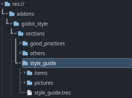
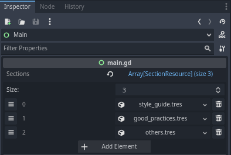
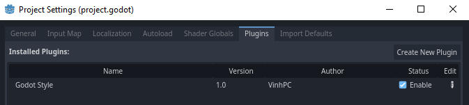

# Adding your own

This is an how you can add your own `SectionResources` and `ItemResources` to the addon.
Have fun tinkering!

## Hierarchy
- `sections/section_name/` contains **one** `SectionResource`, its `ItemResources` and their `pictures`.

- `items/` contains every `ItemResource`.

- `pictures/` contains every picture. 

	

## Adding a new `Section`

1. According to the above hierarchy, create a new folder `sections/new_section/`
2. Right-click the folder -> Choose **Create New** -> Choose **Resource**
3. Search for `SectionResource`, press **Create** and give a file name
4. Double-click on the newly created `SectionResource` -> Its properties appear in the **Inspector** tab.
5. Change the **Name** & add your `ItemResources`
6. Finally, add the `SectionResource` to the addon's main scene
	- Open `godot_style/main.tscn`
	- In the **Scene** tab, double-click **Main**, which is a **Control** node
	- In the **Inspector** tab, add your `SectionResource` to the array **Sections**

		

>**Note:** Disable and re-enable the addon to trigger any updates (or reload the current project or the game engine)

## Adding a new `Item`

1. According to the above hierarchy, create a new folder `sections/any_section/items`
2. For every new **Item**:
	- Right-click the folder -> Choose **Create New** -> Choose **Resource**
	- Search for `ItemResource`, press **Create** and give a file name
	- Double-click on the newly created `ItemResource` -> Its properties appear in the **Inspector** tab.
	- Change the **Name** & add your **Pictures**
4. Finally, add the `ItemResources` to their corresponding `SectionResource`
	

>**Note:** Disable and re-enable the addon to trigger any updates (or reload the current project or the game engine)

## Notes

### Disable and re-enable the addon to trigger any updates

