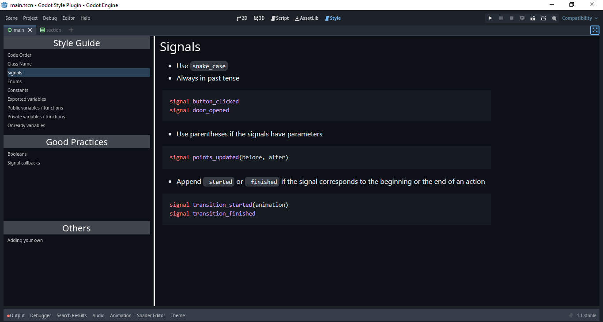
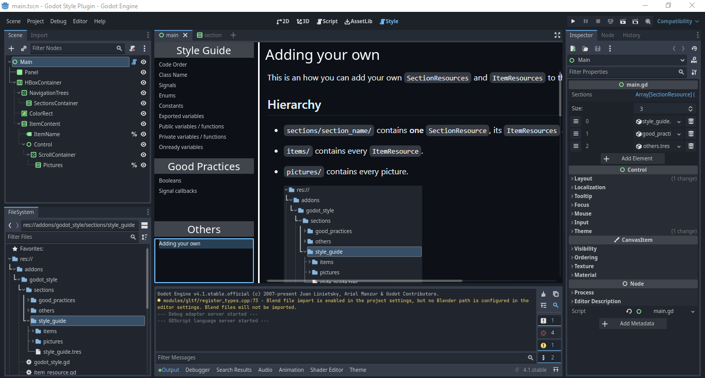
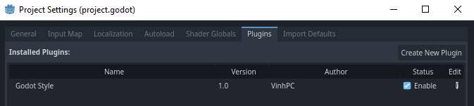

<!-- Improved compatibility of back to top link: See: https://github.com/othneildrew/Best-README-Template/pull/73 -->
<a name="readme-top"></a>
<!--
*** Thanks for checking out the Best-README-Template. If you have a suggestion
*** that would make this better, please fork the repo and create a pull request
*** or simply open an issue with the tag "enhancement".
*** Don't forget to give the project a star!
*** Thanks again! Now go create something AMAZING! :D
-->


<!-- PROJECT SHIELDS -->
<!--
*** I'm using markdown "reference style" links for readability.
*** Reference links are enclosed in brackets [ ] instead of parentheses ( ).
*** See the bottom of this document for the declaration of the reference variables
*** for contributors-url, forks-url, etc. This is an optional, concise syntax you may use.
*** https://www.markdownguide.org/basic-syntax/#reference-style-links
-->


<!-- PROJECT LOGO -->
<br />
<div align="center">
  <a href="https://github.com/VinhPhmCng/DeStress">
    
  </a>

<h2 align="center">Godot Style</h3>

  <p align="center">
    A small Godot addon that provides unofficial style guide in-editor
    <br />
    <a href="https://github.com/VinhPhmCng/DeStress"><strong>Explore the docs »</strong></a>
    <br />
    <br />
</p>
</div>


<!-- TABLE OF CONTENTS -->
<details>
  <summary>Table of Contents</summary>
  <ol>
    <li><a href="#about-the-project">About The Project</a></li>
    <li><a href="#installation">Installation</a></li>
    <li><a href="#materials">Materials</a></li>
    <li><a href="#license">License</a></li>
  </ol>
</details>


<!-- ABOUT THE PROJECT -->
## About The Project






### Built With

<p align="left"><a href="https://godotengine.org/"></a></p>


### Version: Godot 4.1

- A personal project to learn the powerful Godot Engine
- Aiming at beginners who want to learn more about Godot's `Resource` 


### More details
1. It makes use of `custom resources`, which helps to quickly create new `SectionResources` and `ItemResources`.

2. It's very scuffed lol.
   - Items can only contain pictures (Texture2D) as a quick and easy alternative - because I haven't a clue how to implement markdown in Godot.
    
   - Lacking UI elements helping to add new contents - partly because I want users to interact with the provided custom resources

3. The style guide provided ([STYLE_GUIDE.md](STYLE_GUIDE.md)) is a simplified composition of parts of different [materials](#materials).


### Customization
- You can add your own `SectionResources` and `ItemResources` - please refer to [ADDING_YOUR_OWN.md](ADDING_YOUR_OWN.md)


<p align="right">(<a href="#readme-top">back to top</a>)</p>


<!-- INSTALLATION -->
## Installation

### Using Godot Asset Library
- In-editor `AssetLib`
  1. Search for `Godot Style` in Godot's in-editor `AssetLib` and press download 

  2. Enable the addon in `Project/Project Settings/Plugins`

        

- Online
  1. Dowload the ZIP archive from `link`

  2. Import the folder `godot_style/` into your Godot project's `addons/` folder (Godot v4.1).

  3. Enable the addon in `Project/Project Settings/Plugins`

### Manually
1. Clone the repo OR download and extract the ZIP archive.
   ```sh
   git clone https://github.com/VinhPhmCng/GodotStylePlugin.git
   ```

2. Import the folder `godot_style/` into your Godot project's `addons/` folder (Godot v4.1).

3. Enable the addon in `Project/Project Settings/Plugins`

<p align="right">(<a href="#readme-top">back to top</a>)</p>


<!-- MATERIALS -->
## Materials


<p align="right">(<a href="#readme-top">back to top</a>)</p>


<!-- LICENSE -->
## License


<p align="right">(<a href="#readme-top">back to top</a>)</p>